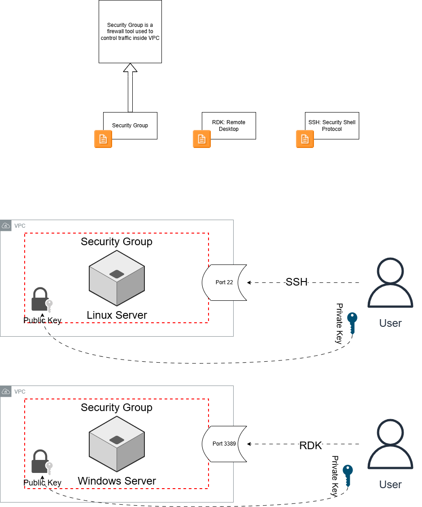

# 💻 Note 1: AWS Foundations │ Servers/ EC2 / SSH / RDK

To complement my studies, I created a diagram that represents how users (it can be a human being or another software) connects with the VPC.

## 😗 Key Concept: VPC 
VPC (Virtual Private Cloud) is a virtual network within a public cloud (for example, AWS 🙂). The VPC contains computer resources that work for a specific reason (for a company or a person).

[link of VPC documentation on AWS website](https://docs.aws.amazon.com/vpc/latest/userguide/what-is-amazon-vpc.html)

*Quick correction: on the diagram, Remote Desktop is RDP, not RDK*

